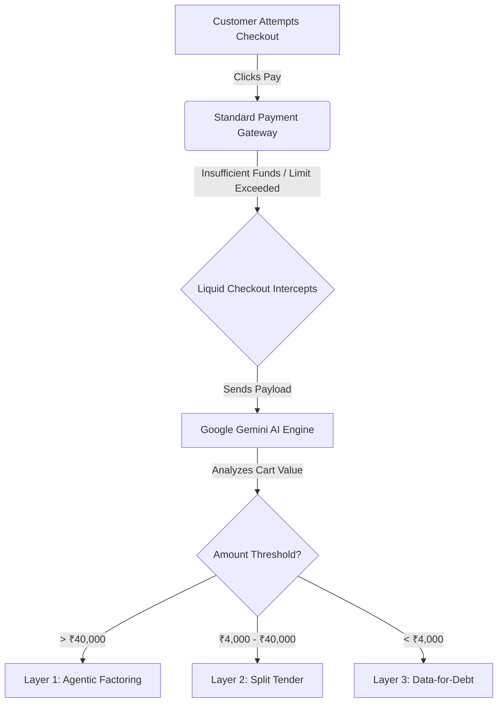

<div align="center">
  
  <h1>Liquid Checkout</h1>
  <p><strong>Autonomous AI Revenue Recovery Engine for E-Commerce</strong></p>
</div>

<br />

## 🚨 The Problem
E-commerce merchants lose millions of dollars every year due to failed payments at checkout (card limits exceeded, insufficient funds, network failures). Current solutions rely on passive "dunning" emails asking users to try again later. But if a user doesn't have the funds *right now*, the merchant loses the sale forever.

## 🚀 Our Solution: The AI Intercept
**Liquid Checkout** is a proactive API layer that sits between the merchant and the payment gateway. When a transaction fails, it catches the error in milliseconds and triggers a **3-Layer Conversational AI Waterfall** powered by Google Gemini to negotiate a custom payment solution with the customer before they can close the tab.

### The 3-Layer Waterfall Strategy
1. **🟢 Layer 1: Agentic Factoring (High Ticket > ₹40,000)**
   Gemini acts as a real-time underwriter. It approves a micro-loan on the spot, guaranteeing the merchant a 95% payout, and giving the customer a 6-month EMI plan to complete the checkout instantly.
2. **🟡 Layer 2: Split Tender (Mid Ticket ₹4,000 - ₹40,000)**
   If a card limit is exceeded, the AI instantly splits the total bill and generates two separate Razorpay links, allowing the customer to pay with two different cards or bank accounts simultaneously.
3. **🟣 Layer 3: Data-for-Debt (Low Ticket < ₹4,000)**
   If a small transaction fails, the AI waives the failed fee entirely in exchange for the user completing a high-value product feedback survey, turning a lost sale into valuable marketing data.

---

## 🛠️ Enterprise Architecture

* **Frontend:** Next.js, Tailwind CSS (Glassmorphism UI), Zustand (State Management)
* **Backend:** Python FastAPI, Google Gemini 1.5 Flash (Structured JSON), Razorpay API
* **Database:** Persistent SQLite via SQLAlchemy (Immutable AI Audit Trails)
* **DevOps:** Fully Dockerized, GitHub Actions CI/CD Pipeline
* **Safety:** Built-in "AI Guardrails" Dashboard (Hallucination Kill-Switches, Max Discount Limits)



## 💻 Running the Demo Locally

1. **Start the Backend**
   ```bash
   cd backend
   .\venv\Scripts\Activate
   uvicorn main:app --reload --port 8000
   ```
2. **Start the Frontend**
   ```bash
   cd frontend
   npm run dev
   ```
3. Open `http://localhost:3000` in your browser. Navigate to the **Demo Store** to trigger the AI failures, and monitor the **Live Dashboard** to see the SQLite database update in real-time!

---
*Built for the 2026 AI Revenue Recovery Hackathon*
